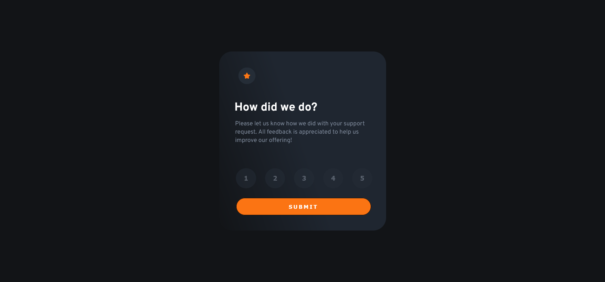
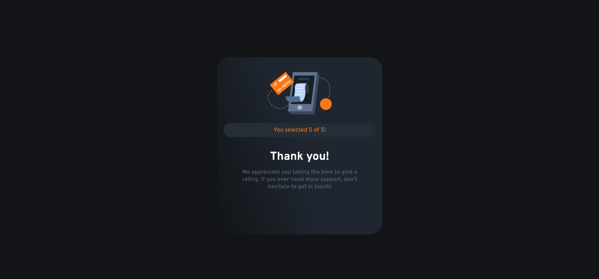

<<<<<<< HEAD
# interactive-rate-card
=======
# Frontend Mentor - Interactive rating component solution

This is a solution to the [Interactive rating component challenge on Frontend Mentor](https://www.frontendmentor.io/challenges/interactive-rating-component-koxpeBUmI). Frontend Mentor challenges help you improve your coding skills by building realistic projects. 

## Table of contents

- [Overview](#overview)
  - [The challenge](#the-challenge)
  - [Screenshot](#screenshot)
  - [Links](#links)
- [My process](#my-process)
  - [Built with](#built-with)
  - [What I learned](#what-i-learned)
  - [Continued development](#continued-development)
  - [Useful resources](#useful-resources)
- [Author](#author)
- [Acknowledgments](#acknowledgments)

**Note: Delete this note and update the table of contents based on what sections you keep.**

## Overview

### The challenge

Users should be able to:

- View the optimal layout for the app depending on their device's screen size
- See hover states for all interactive elements on the page
- Select and submit a number rating
- See the "Thank you" card state after submitting a rating

### Screenshot





### Links

- Solution URL: [Add solution URL here](https://your-solution-url.com)
- Live Site URL: [Add live site URL here](https://your-live-site-url.com)

## My process

### Built with

- Semantic HTML5 markup
- CSS custom properties
- Flexbox
- CSS Grid
- Mobile-first workflow


### What I learned

In this project i learned a little bit of animation and of course my favorite javascript.
I practice with flexbox ,and  struggle with the two same cards ,but at the end it was fun.
I learned how to read the textContent of all buttons.

```js
buttons.forEach((button) =>{
    button.addEventListener('click' , (event) =>{
        // target the text content of the button
       rate=event.target.textContent;
    //    console.log(rate);
       rateText.textContent='You selected ' + rate + ' of 5!';
    })
   
})

}
```


### Continued development
practice javascript!A lot!

### Useful resources

- [w3schools](https://www.w3schools.com/default.asp) - This helped me with the animation effect on my cards


## Author

- Website - [superOzzy](https://www.your-site.com)
- Frontend Mentor - [@yourusername](https://www.frontendmentor.io/profile/superozzy)


>>>>>>> d6c3fac (adding files)
